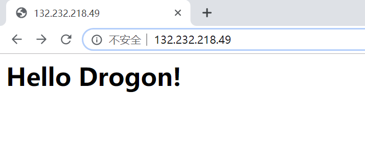

## 静态网站

我们从一个最简单的例子开始，介绍drogon的使用，在这个例子中我们使用命令行工具drogon_ctl创建一个工程：

```shell
drogon_ctl create project your_project_name
```

进入工程目录，可以看到如下文件:

```shell
├── build                         构建文件夹
├── CMakeLists.txt                工程的cmake配置文件
├── config.json                   drogon应用的配置文件
├── controllers                   存放控制器文件的目录
├── filters                       存放过滤器文件的目录
├── main.cc                       主程序
├── models                        数据库模型文件的目录
│   └── model.json
└── views                         存放视图csp文件的目录
```

文件夹的名字就反应了它的用途，用户可以把各类文件(如控制器、过滤器、视图等等)分别放入对应的文件夹，方便项目管理，请读者自行实验。关于drogon_ctl的详细使用，可参见[drogon_ctl](CHN-11-drogon_ctl命令)

让我们看一下main.cc文件，内容如下：

```c++
#include <drogon/HttpAppFramework.h>
int main() {
    //Set HTTP listener address and port
    drogon::app().addListener("0.0.0.0",80);
    //Load config file
    //drogon::app().loadConfigFile("../config.json");
    //Run HTTP framework,the method will block in the internal event loop
    drogon::app().run();
    return 0;
}
```

然后构建项目:

```shell
cd build
cmake ..
make
```

编译完成后，运行目标程序`./your_project_name`.

现在，我们在Http根目录添加一个最简单的静态文件index.html:

```shell
echo '<h1>Hello Drogon!</h1>' >>index.html
```
Http根目录默认值是`"./"`， 也就是webapp程序运行的当前路径， Http根目录也可在config.json配置文件中进行更改，可参见[配置文件](CHN-10-配置文件)， 然后在地址栏输入`http://localhost`或`http://localhost/index.html`(或者你的webapp所在服务器的ip)可以访问到这个页面：


如果服务器找不到浏览器访问的页面，将返回404页面：


**注意：请确认服务器的防火墙已经打开80端口，否则你看不到这些页面。**

我们可以把一个静态网站的目录和文件复制到这个webapp的运行目录，然后通过浏览器就可以访问到它们，drogon默认支持的文件类型有"html","js","css","xml","xsl","txt","svg","ttf","otf","woff2","woff","eot","png","jpg","jpeg","gif","bmp","ico","icns"等等，drogon也提供接口更改这些文件类型，具体请参考[HttpAppFramework的API](API-HttpAppFramework-中文)。

## 动态网站

下面我们看看怎么给这个应用添加控制器（controller）,并使用控制器（controller）输出内容。

在`controller`目录下运行drogon_ctl命令行工具生成控制器（controller）源文件: 

```shell
drogon_ctl create controller TestCtrl
```

可以看到，目录下新增加了两个文件，TestCtrl.h和TestCtrl.cc:

TestCtrl.h如下：
```c++
#pragma once
#include <drogon/HttpSimpleController.h>
using namespace drogon;
class TestCtrl:public drogon::HttpSimpleController<TestCtrl>
{
public:
    virtual void asyncHandleHttpRequest(const HttpRequestPtr &req,
                                        std::function<void (const HttpResponsePtr &)> &&callback)override;
    PATH_LIST_BEGIN
    //list path definitions here;
    //PATH_ADD("/path","filter1","filter2",HttpMethod1,HttpMethod2...);
    PATH_LIST_END
};
```

TestCtrl.cc如下：
```c++
#include "TestCtrl.h"
void TestCtrl::asyncHandleHttpRequest(const HttpRequestPtr &req,
                                      std::function<void (const HttpResponsePtr &)> &&callback)
{
    //write your application logic here
}
```

我们编辑一下这两个文件，让这个控制器处理函数回应一个简单的“Hello World!”。

TestCtrl.h如下：

```c++
#pragma once
#include <drogon/HttpSimpleController.h>
using namespace drogon;
class TestCtrl:public drogon::HttpSimpleController<TestCtrl>
{
public:
    virtual void asyncHandleHttpRequest(const HttpRequestPtr &req,
                                        std::function<void (const HttpResponsePtr &)> &&callback)override;
    PATH_LIST_BEGIN
    //list path definitions here;
    //PATH_ADD("/path","filter1","filter2",HttpMethod1,HttpMethod2...);
    PATH_ADD("/",Get,Post);
    PATH_ADD("/test",Get);
    PATH_LIST_END
};
```

使用PATH_ADD添加路径到处理函数的映射，这里映射了两个路径'/'和'/test',并在路径后面添加了对这个路径的约束。

TestCtrl.cc如下：

```c++
#include "TestCtrl.h"
void TestCtrl::asyncHandleHttpRequest(const HttpRequestPtr &req,
                                      std::function<void (const HttpResponsePtr &)> &&callback)
{
    //write your application logic here
    auto resp=HttpResponse::newHttpResponse();
    resp->setStatusCode(k200OK);
    resp->setContentTypeCode(CT_TEXT_HTML);
    resp->setBody("Hello World!");
    callback(resp);
}
```

重新用cmake编译这个工程，然后运行目标程序`./your_project_name`：

```shelll
cd ../build
cmake ..
make
./your_project_name
```

在浏览器地址栏输入`http://localhost/`或者`http://localhost/test`，你就可以在浏览器看到`Hello World!`了。

**注意: 同时存在静态和动态资源的情况下，框架优先使用控制器响应请求，此例中`http://localhost/` 响应的是`TestCtrl`控制器的输出`Hello Word！`而不是静态网页`index.html`的`Hello Drogon！`**


我们看到，在应用中添加controller非常简单，只需要添加对应的源文件即可，甚至main文件不用做任何修改，这种低耦合度的设计对web应用开发是非常有效的。

**注意: Drogon没有限制控制器（controller）源文件的位置，也可以放在工程目录下，甚至可以在`CMakeLists.txt`中指定到新的目录中，为了方便管理，建议将控制器源文件放在controllers目录。**

# 04.0 [控制器简介](CHN-04-0-控制器-简介)