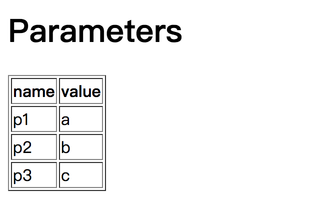

### 视图介绍

虽然目前前端渲染技术大行其道，使后端应用服务只需要返回相应数据给前端即可，不过，一个好的web框架还是应该提供后端渲染技术，使服务端程序可以动态生成HTML页面。视图（View）可以帮助使用者生成这些页面，顾名思义，它只负责做跟展示相关的工作，而复杂的业务逻辑都应该交给控制器完成。

最早的web应用程序都是把HTML嵌入到程序编码里，达到动态生成HTML页面的目的，不过这样做有效率低、不直观等诸多缺点，于是出现了诸如JSP等语言，反其道而行之，把程序代码嵌入到HTML页面里。drogon采用的当然是后一种方案，不过，很明显，由于C++是编译执行的，我们需要把这种嵌入了C++代码的页面转换成C++源程序，才能编译进应用程序。所以，drogon定义了自己专门的CSP(C++ Server Pages)描述语言，使用命令行工具`drogon_ctl`可以把csp文件转换成C++源文件以供编译。

### Drogon的csp

drogon的csp方案很简单，我们用特殊的标记符号把C++代码嵌入到HTML页面里就可以了。其中：

* 夹在标签`<%inc`和`%>`之间的内容被视为需要引用的头文件部分，这里只能写入`#include`语句，如`<%inc#include "xx.h" %>`,不过很多常见的头文件drogon都自动包含了，用户基本上用不到这个标签；
* 夹在标签`<%c++`和`%>`之间的所有内容都被视为C++的代码,如`<c++ std:string name="drogon"; %>`；
* C++的代码一般都会原封不动的转移到目标源文件中，除了下面两种特殊标记：
  * `@@`代表控制器传过来的data变量，类型是`HttpViewData`，可以从中获取需要的内容；
  * `$$`代表表示页面内容的流对象，可以把需要显示的内容通过`<<`操作符显示在页面上；
* 夹在标签`[[`和`]]`之间的内容被认为是变量名字，view会以这个名字为keyword从控制器传过来的数据里找到对应的变量，并把它输出到页面的对应位置，变量名字前后的空格会被省略，`[[`和`]]`不要分行写，同时，出于性能考虑，只支持三种字符串数据类型(const char *,std::string和const std::string，因为输出时涉及数据类型判断，过多类型会导致过多的条件语句)，其他数据类型请用上面提到的方式输出(或者将需要输出的变量以string类型存入data中);
* 夹在标签``之间的内容被认为是C++程序里变量的名字或表达式（而不是控制器传过来的数据的keyword），view会把该变量的内容或表达式的值输出到页面的对应位置。容易知道``等效于`<%c++$$<<val.xx;%>`,只是前者更为简单直观。同样的，两个标签不要分行写；
* 夹在标签`<%view`和`%>`之间的内容被认为是子视图的名字，框架会找到相应的子视图并把它的内容填充到该标签所在位置；视图名字前后的空格会被忽略，同时`<%view`和`%>`不要分行写，子视图和父视图共用控制器的数据, 可以多级嵌套但不要循环嵌套。
* 夹在标签`<%layout`和`%>`之间的内容被认为是布局的名字，框架会找到相应的布局并把本视图的内容填充到该布局的某个位置（在布局中由占位符`[[]]`标定该位置）；布局名字前后的空格会被忽略，同时`<%layout`和`%>`不要分行写，可以多级嵌套但不要循环嵌套。

### 视图的使用

drogon应用程序的http响应都是由控制器handler生成的，所以，由视图渲染的响应也由handler生成，通过调用如下接口生成：

```c++
static HttpResponsePtr newHttpViewResponse(const std::string &viewName,
                                           const HttpViewData &data);
```

这个接口是HttpResponse类的静态方法，它有两个参数：

* **viewName**: 视图的名字，传入的csp文件名(**扩展名可省略**);
* **data**: 控制器的handler传给视图的数据，类型是`HttpViewData`，这是个特殊的map，可以存入和取出任意类型的对象，具体使用请参考[HttpViewData API](API-HttpViewData-中文)说明；

可以看到，控制器不需要引用视图的头文件，控制器和视图实现了很好的解耦；他们唯一的联系是data变量，对data的内容，控制器和视图要有一致的约定；

### 一个简单的例子

现在我们做一个例子，把浏览器发来的HTTP请求的参数显示在返回的html页面里。

我们这里直接用HttpAppFramework的接口定义handler，在main文件中，调用run()方法之前加入如下代码：

```c++
drogon::HttpAppFramework::instance()
 .registerHttpMethod
  ("/list_para",
   [=](const HttpRequestPtr &req,
       std::function<void (const HttpResponsePtr &)> &&callback)
       {
            auto para=req->getParameters();
            HttpViewData data;
            data.insert("title","ListParameters");
            data.insert("parameters",para);
            auto resp=HttpResponse::newHttpViewResponse("ListParameters.csp",data);
            callback(resp);
        }
   );
```

上面这段代码把一个lambda表达式handler注册到`/list_para`路径上，获取请求的参数传递给视图显示。
然后进入views文件夹，创建一个视图文件ListParameters.csp，内容如下：

```html
<!DOCTYPE html>
<html>
<%c++
    auto para=@@.get<std::unordered_map<std::string,std::string>>("parameters");
%>
<head>
    <meta charset="UTF-8">
    <title>[[ title ]]</title>
</head>
<body>
    <%c++ if(para.size()>0){%>
    <H1>Parameters</H1>
    <table border="1">
      <tr>
        <th>name</th>
        <th>value</th>
      </tr>
      <%c++ for(auto iter:para){%>
      <tr>
        <td></td>
        <td><%c++ $$<<iter.second;%></td>
      </tr>
      <%c++}%>
    </table>
    <%c++ }else{%>
    <H1>no parameter</H1>
    <%c++}%>
</body>
</html>
```

我们可以通过下面的命令将ListParameters.csp文件转换成c++源文件：

```shell
drogon_ctl create view ListParameters.csp
```

运行完毕后，当前目录会出现ListParameters.h和ListParameters.cc两个源文件，就可以用来编译进web应用程序里了。

用cmake重新编译整个工程，运行目标程序webapp，就可以在浏览器里测试效果了，在地址栏输入`http://localhost/list_para?p1=a&p2=b&p3=c`，就可以看到如下页面：



后端渲染的html页面就这样简单的加上了。虽然页面简陋点，但不影响我们说明视图的用法。

### csp文件的自动化处理

**注意：如果你的工程是使用`drogon_ctl`命令创建的，那么本节描述的内容已经由该命令自动帮你做了。**

显然，每次修改csp文件都需要手动运行drogon_ctl命令显得太不方便了，我们可以把drogon_ctl的处理放进CMakeLists.txt文件里，仍以前面的例子为例，假设我们把所有的csp文件都放到views文件夹里，则CMakeLists.txt可以添加如下处理：

```cmake
FILE(GLOB SCP_LIST ${CMAKE_CURRENT_SOURCE_DIR}/views/*.csp)
foreach(cspFile ${SCP_LIST})
    message(STATUS "cspFile:" ${cspFile})
    EXEC_PROGRAM(basename ARGS "-s .csp ${cspFile}" OUTPUT_VARIABLE classname)
    message(STATUS "view classname:" ${classname})
    add_custom_command(OUTPUT ${classname}.h ${classname}.cc
        COMMAND drogon_ctl
        ARGS create view ${cspFile}
        DEPENDS ${cspFile}
        VERBATIM )
   set(VIEWSRC ${VIEWSRC} ${classname}.cc)
endforeach()
```

然后在add_executable语句中添加新的源文件集合${VIEWSRC},如下：

```cmake
add_executable(webapp ${SRC_DIR} ${VIEWSRC})
```

上述措施在`drogon_ctl create project`命令生成的工程里已经写入CMakeLists.txt文件，用户在views文件夹创建的csp文件都会被自动转换并编译进应用程序。


### 视图的动态编译和加载

drogon提供了在应用运行期动态编译和加载csp文件的方法，使用如下接口设置：

```c++
void enableDynamicViewsLoading(const std::vector<std::string> &libPaths);
```

该接口是`HttpAppFramework`的成员方法，参数是一个字符串数组，代表视图csp文件所在目录的列表。调用这个接口后，drogon将自动搜索这些目录，发现新的或者被修改的csp文件后，都将自动生成源文件、编译成动态库文件并加载到应用里，整个过程应用程序无需重启。用户可以自行实验，观察csp的修改带来的页面变化。

很显然，该功能依赖于开发环境，如果drogon和webapp都在这台服务器编译，则动态加载csp页面也应该没有问题；

**注意：动态加载的视图不能静态编译进程序，也就是说，如果一个视图已经静态编译进程序，那么它无法通过动态加载更新，你可以单独建一个动态视图路径，并在开发阶段把视图移动到这个路径进行调试（linux操作系统没有这个问题）。**

**注意: 该特性最好用于在开发阶段方便调整页面，生产环境部署还是建议直接编译成目标文件运行，这主要是出于安全性和稳定性考虑。**

**注意: 如果加载时遇到`symbol not found`错误，请使用`cmake .. -DCMAKE_ENABLE_EXPORTS=on`或取消CMakeLists.txt最后一行对`set_property(TARGET ${PROJECT_NAME} PROPERTY ENABLE_EXPORTS ON)`的注释，并重新编译你的工程**

# 07 [会话](CHN-07-会话)