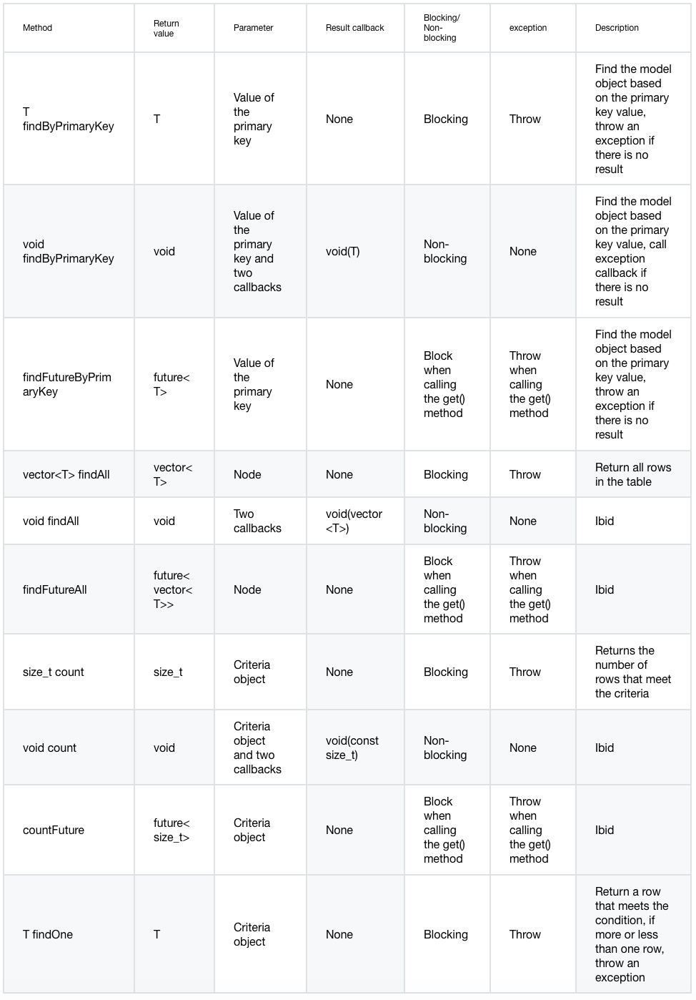
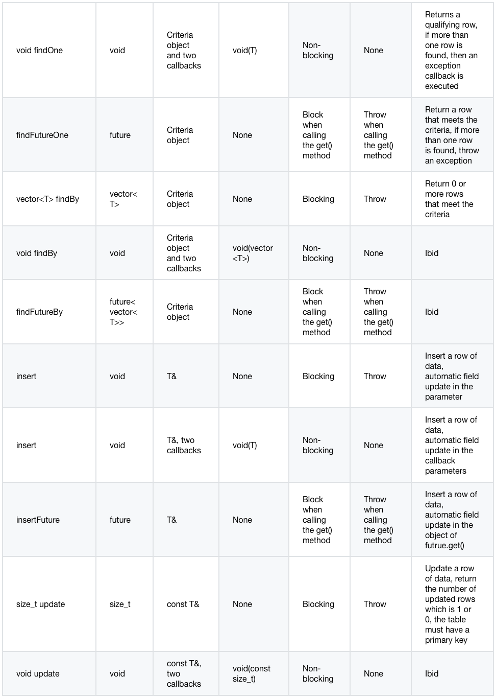
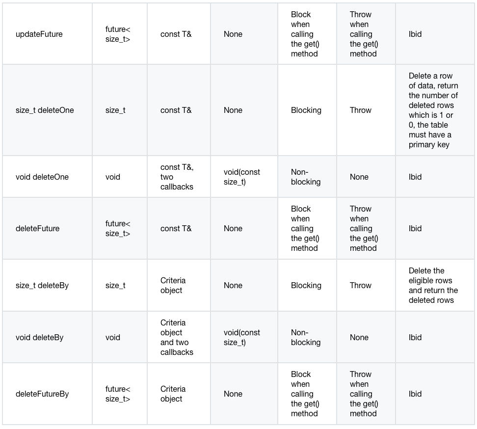

### Model

Using Drogon's ORM, you first need to create model classes. Drogon's command-line program drogon_ctl provides the ability to generate model classes. The program reads tables information from a user-specified database and automatically generates multiple source files for the model classes based on this information. When the user uses the model, please include the corresponding header file.

Obviously, each Model class corresponds to a specific database table, and an instance of a model class, corresponds a row of records in the table.

The command to create model classes is as follows:

```shell
drogon_ctl create model <model_path>
```

The last parameter is the path to store model classes. There must be a configuration file model.json in the path to configure the connection parameters of drogon_ctl to the database. It is a file in JSON format and supports comments. The examples are as follows:

```json
{
    "rdbms":"postgresql",
    "host":"127.0.0.1",
    "port":5432,
    "dbname":"test",
    "user":"test",
    "passwd":"",
    "tables":[]
}
```

The configured parameters are the same as the application's configuration file. Please refer to [Configuration File](ENG-10-Configuration-File#db_clients).

The `tables` configuration option is unique to the model configuration. It is an array of strings. Each string represents the name of the table to be converted into a model class. If this option is empty, all tables will be used to generate model classes.

The models directory and the corresponding model.json file have been created in advance in the project directory created with the `drogon_ctl create project` command. The user can edit the configuration file and create model classes with the drogon_ctl command.

### Model Class Interface

There are mainly two types of interfaces that the user directly uses, getter interfaces and setter interfaces.

There are two types of getter interfaces:

* An interface of the form like `getColumnName` gets the smart pointer of the field. The return value is a pointer instead of a value is primarily used for the NULL field. The user can determine whether the field is a NULL field by determining whether the pointer is empty.
* An interface of the form like `getValueOfColumnName`, hence the name, is the value obtained. For efficiency reasons, the interface returns a constant reference. If the corresponding field is NULL, the interface returns the default value given by the function parameter.

In addition, the binary block type (blob, bytea) has a special interface, in the form of `getValueOfColumnNameAsString`, which loads the binary data into the std::string object and returns it to the user.

The setter interface is used to set the value of the corresponding field, in the form of `setColumnName`, and the parameter type and field type correspond. Automatically generated fields (such as self-incrementing primary keys) do not have a setter interface.

The toJson() interface is used to convert the model object into a JSON object. The binary block type is base64 encoded. Please experiment with it yourself.

The static members of the Model class represent the information of the table. For example, the name of each field can be obtained through the `Cols` static member, which is convenient to use in an editor that supports automatic prompting.

### Mapper Class Template

The mapping between the model object and the database table is performed by the Mapper class template. The Mapper class template encapsulates common operations such as adding, deleting, and changing, so that the user can perform the above operations without writing a SQL statement.

The construction of the Mapper object is very simple. The template parameter is the type of the model you want to access. The constructor has only one parameter, which is the DbClient smart pointer mentioned earlier. As mentioned earlier, the Transaction class is a subclass of DbClient, so you can also construct a Mapper object with a smart pointer to a transaction, which means that the Mapper mapping also supports transactions.

Like DbClient, Mapper also provides asynchronous and synchronous interfaces. The synchronous interface is blocked and may throw an exception. The returned future object is blocked in get() and may throw an exception. The normal asynchronous interface does not throw an exception, but returns the result through two callbacks (result callback and exception callback). The type of the exception callback is the same as that in the DbClient interface. The result callback is also divided into several categories according to the interface function. The list is as follows (T is the template parameter, which is the type of the model):





**Note: When using a transaction, the exception does not necessarily cause a rollback. Transactions will not be rolled back in the following cases: When the findByPrimaryKey interface does not find a qualified row, when the findOne interface finds fewer or more than one record, the mapper will throw an exception or enter an exception callback, the exception type is UnexpectedRows. If the business logic needs to be rolled back in this condition, please explicitly call the rollback() interface.**

### Criteria

In the previous section, many interfaces required input criteria object parameters. The criteria object is an instance of the Criteria class, indicating a certain condition, such as a field greater than, equal to, less than a given value, or a condition such as `is Null`.

The constructor of a criteria object is very simple. Generally, the first argument is the name of the field, the second argument is the enumeration value representing the comparison type, and the third argument is the value being compared. If the comparison type is IsNull or IsNotNull, the third parameter is not required.

E.g：

```c++
Criteria("user_id",CompareOperator::EQ,1);
```

The above example shows that the field user_id is equal to 1 as a condition. In practice, we prefer to write the following:

```c++
Criteria(Users::Cols::_user_id,CompareOperator::EQ,1);
```

This is equivalent to the previous one, but this can use the editor's automatic prompts, which is more efficient and less prone to errors;

Criteria objects support AND and OR operations. The sum of two criteria objects constructs a new criteria object, which makes it easy to construct nested conditions. For example:

```c++
Mapper<Users> mp(dbClientPtr);
auto users = mp.findBy(
(Criteria(Users::Cols::_user_name,CompareOperator::LIKE,"%Smith")&&Criteria(Users::Cols::_gender,CompareOperator::EQ,0))
||(Criteria(Users::Cols::_user_name,CompareOperator::LIKE,"%Johnson")&&Criteria(Users::Cols::_gender,CompareOperator::EQ,1))
));
```

The above program is to query all the men named Smith or the women named Johnson from the users table.

### Mapper's Chain Interface

Some common sql constraints, such as limit, offset, etc., Mapper class templates also provide support, provided in the form of a chained interface, meaning that users can string multiple constraints to write. After executing any of the interfaces in Section 10.5.3, these constraints are cleared, that is, they are valid in one operation:

```c++
Mapper<Users> mp(dbClientPtr);
auto users = mp.orderBy(Users::Cols::_join_time).limit(25).offset(0).findAll();
```

This program is to select the user list from the `users` table, return the first page of 25 rows per page.

Basically, the name of the chain interface expresses its function, so I won't go into details here. Please refer to the Mapper.h header file.

### Convert

The `convert` configuration option is unique to the model configuration. It adds a convert layer before or after a value is read from or written to database.  The object consists of a boolean key `enabled` to use this function or not. The array of `ìtems` objects consists of following keys:

* `table`: name of the table, which holds the column
* `column`: name of the column
* `method`: object
  * `after_db_read`: string, name of the method which is called after reading from database, signature: void([const] std::shared_ptr<type> [&])
  * `before_db_write`: string, name of the method which is called before writing to database, signature: void([const] std::shared_ptr<type> [&])
* `includes`: array of strings, name of the include files surrounded by the \" or <,>

### Relationships

The relationship between the database tables can be configured through the `relationships` option in the model.json configuration file. We use manual configuration instead of automatically detecting the foreign key of the table because the actual project does not use foreign keys. It is also very common.

If the `enable` option is true, the generated model classes will add corresponding interfaces according to the `relationships` configuration.

There are three types of relationships,'has one','has many' and 'many to many'.

#### has one

`has one` represents a one-to-one relationship. A record in the original table can be associated with a record in the target table, and vice versa. For example, the `products` table and `skus` table have a one-to-one relationship, we can define as follows:

```json
{
    "type": "has one",
    "original_table_name": "products",
    "original_table_alias": "product",
    "original_key": "id",
    "target_table_name": "skus",
    "target_table_alias": "SKU",
    "target_key": "product_id",
    "enable_reverse": true
}
```

among them:

* "type": Indicates that this relationship is one-to-one;
* "original_table_name": the name of the original table (the corresponding method will be added to the model corresponding to this table);
* "original_table_alias": alias (the name in the method, because the one-to-one relationship is singular, so set it to `product`), if this option is empty, the table name is used to generate the method name;
* "original_key": the associated key of the original table;
* "target_table_name": the name of the target table;
* "target_table_alias": the alias of the target table, if this option is empty, the table name is used to generate the method name;
* "target_key": the associated key of the target table;
* "enable_reverse": Indicate whether to automatically generate a reverse relationship, that is, add a method to obtain records of the original table in the model class corresponding to the target table.

According to this setting, in the model class corresponding to the products table, the following method will be added:

```c++
    /// Relationship interfaces
    void getSKU(const DbClientPtr &clientPtr, 
                const std::function<void(Skus)> &rcb,
                const ExceptionCallback &ecb) const;
```

This is an asynchronous interface that returns the SKU object associated with the current product in the callback.

At the same time, since the enable_reverse option is set to true, the following method will be added to the model class corresponding to the skus table:

```c++
    /// Relationship interfaces
    void getProduct(const DbClientPtr &clientPtr, 
                    const std::function<void(Products)> &rcb,
                    const ExceptionCallback &ecb) const;
```

#### has many

`has many` represents a one-to-many relationship. In such a relationship, the table representing `many` generally has a field associated with the primary key of another table. For example, products and reviews usually have a one-to-many relationship, we can define as follows:

```json
{
    "type": "has many",
    "original_table_name": "products",
    "original_table_alias": "product",
    "original_key": "id",
    "target_table_name": "reviews",
    "target_table_alias": "",
    "target_key": "product_id",
    "enable_reverse": true
}
```

The meaning of each configuration above is the same as the previous example, so I won't repeat it here, because there are multiple reviews for a single product, so there is no need to create an alias of reviews. According to this setting, after running `drogon_ctl create model`, the following interface will be added to the model corresponding to the products table:

```c++
    void getReviews(const DbClientPtr &clientPtr, 
                    const std::function<void(std::vector<Reviews>)> &rcb,
                    const ExceptionCallback &ecb) const;
```

In the model corresponding to the reviews table, the following interface will be added:

```c++
    void getProduct(const DbClientPtr &clientPtr, 
                    const std::function<void(Products)> &rcb,
                    const ExceptionCallback &ecb) const;
```

#### many to many

As the name implies, `many to many` represents a many-to-many relationship. Usually, a many-to-many relationship requires a pivot table. Each record in the pivot table corresponds to a record in the original table and another record in the target table. For example, the `products` table and `carts` table have a many-to-many relationship, which can be defined as follows:

```json
{
    "type": "many to many",
    "original_table_name": "products",
    "original_table_alias": "",
    "original_key": "id",
    "pivot_table": {
        "table_name": "carts_products",
        "original_key": "product_id",
        "target_key": "cart_id"
    },
    "target_table_name": "carts",
    "target_table_alias": "",
    "target_key": "id",
    "enable_reverse": true
}
```

For the pivot table, there is an additional `pivot_table` configuration. The options inside easy to understand and are omitted here.

The model of `products` generated according to this configuration will add the following method:

```c++
    void getCarts(const DbClientPtr &clientPtr, 
                  const std::function<void(std::vector<std::pair<Carts,CartsProducts>>)> &rcb,
                  const ExceptionCallback &ecb) const;
```

The model class of the carts table will add the following method:

```c++
    void getProducts(const DbClientPtr &clientPtr, 
                     const std::function<void(std::vector<std::pair<Products,CartsProducts>>)> &rcb,
                     const ExceptionCallback &ecb) const;
```

### Restful API controllers

drogon_ctl can also generate restful-style controllers for each model (or table) while creating models, so that users can generate APIs that can add, delete, modify, and search tables with zero coding. These APIs support many functions such as quering by primary key, quering by conditions, sorting by specific fields, returning specified fields, and assigning alias for each field to hide the table structure. It is controlled by the `restful_api_controllers` option in model.json. these options have corresponding comments in the json file.

It should be noted that the controller of each table is designed to be composed of a base class and a subclass. Among them, the base class and the table are closely related, and the subclass is used to implement special business logic or modify the interface format. The advantage of this design is that when the table structure changes, users can update only the base class without overwriting the subclass(by setting the `generate_base_only` option to `true`).


# 08.4 [FastDbClient](ENG-08-4-DataBase-FastDbClient)
